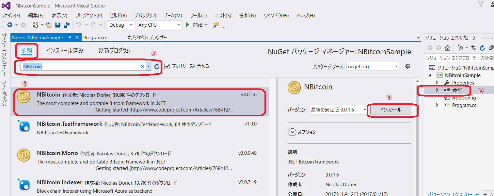
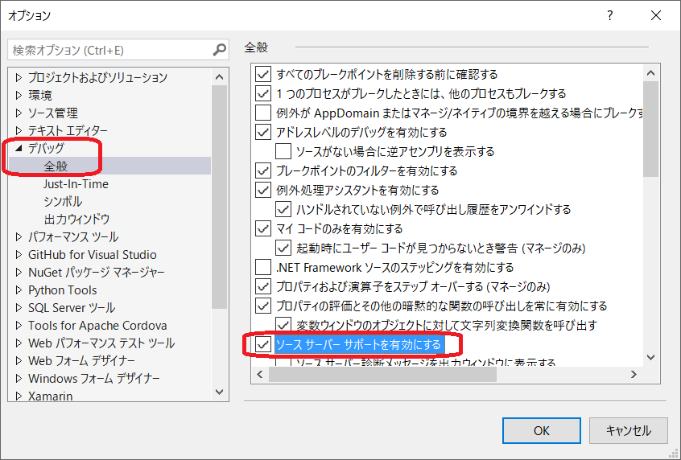

## プロジェクトのセットアップ {#project-setup}

説明を始める前に、プロジェクトをどのように構成するべきかを説明する。

1. 新規プロジェクトを作成する（.NET 4.5.2以上）
2. ソリューションエクスプローラーの「参照」で右クリックし、「NuGet パッケージの管理」をクリック
3. 「**NBitcoin**」を検索しインストールする（MacやLinuxの場合は NBitcoin.Mono を使う）


> **ヒント:** もしMacやLinuxを使っている場合、NBitcoin.Mono ではなく NBitcoin を使用すると、いくつかクラスがないという問題が起きるので気をつけましょう。

NBitcoinは、この本のメイン筆者であるNicolas Dorierがメンテナンスしている、.NETで作られたオープンソースライブラリである。C\#でビットコインのソフトウェアを開発するのであれば、このライブラリを使うべきだろう。NBitcoinはクロスプラットフォームアプリケーションをサポートする。

## NBitcoinのソースコードをデバッグする方法（オプション）

いろいろと簡単に調べられるように、NBitcoinは、そのソースコード内をデバッグできるようにしてある。この機能が使えるようにするためには、Visual Studioのツール/オプション/デバッグで「ソースサーバーサポートを有効にする」をチェックする必要がある。


これで、もしNBitcoinのコードにステップインをすると、ソースコードがGitHubから自動的に取得され、visual studioのデバッガーに表示される。

## .NET Core で使用する方法

**Visual Studio Code**を使用している方もこの手順でプロジェクトをセットアップできます。

もし.NET Coreを使ってプロジェクトをセットアップする場合は、[.NET Core](https://www.microsoft.com/net/core)をまずインストールすること。

そして以下のコマンドをターミナルで実行する。

```bash
mkdir MyProject
cd MyProject
dotnet new console
dotnet add package NBitcoin
dotnet restore
```

そして `Program.cs` を編集しよう。

```cs
using System;
using NBitcoin;

namespace _125350929
{
    class Program
    {
        static void Main(string[] args)
        {
            Console.WriteLine("Hello World! " + new Key().GetWif(Network.Main));
        }
    }
}
```

以下のコマンドで実行できるはずだ。

```bash
dotnet run
```
